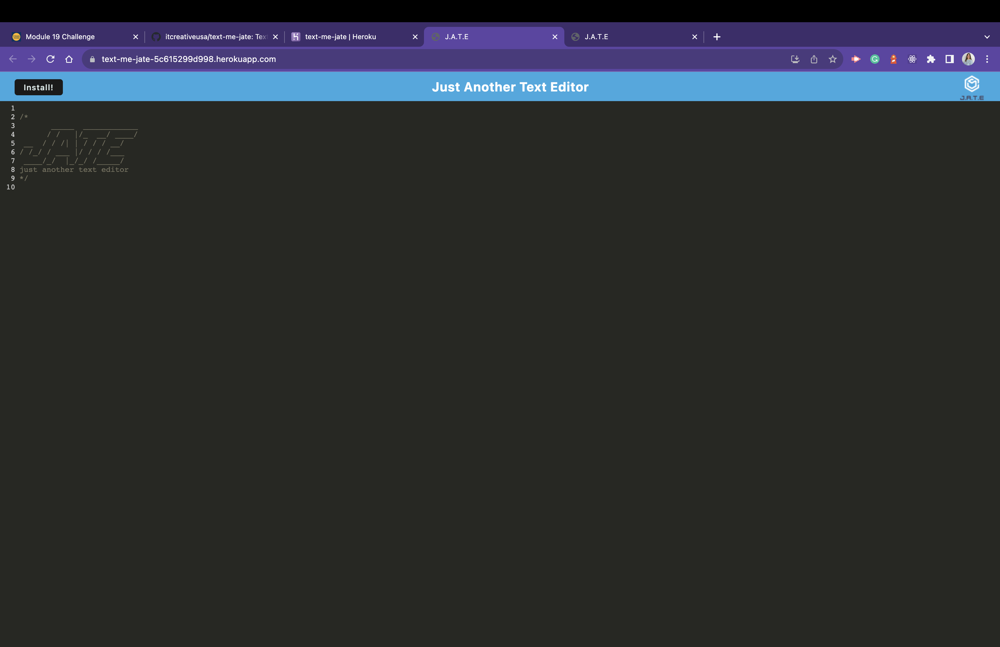

# link-minds

## Description

Deployed application link on GitHub
https://github.com/itcreativeusa/text-me-jate

Deployed application link on Heroku

Text-me Progressive Web Application is a text editor that runs in the browser and creates notes or code snippets with or without an internet connection.
Application have an option to install as a Progressive Web Application.

## Table of Contents

- [Installation](#installation)
- [Usage](#usage)
- [Screenshots](#screenshots)
- [Requirements](#requirements)
- [Credits](#credits)
- [License](#license)

## Installation

N/A

## Requirements

N/A

## Usage

Open heroku link in the browser and start using the application.
To install application as a Progressive Web Application click on the install button in the address bar.

## Screenshots

Screenshot located in `./img/` folder

## Credits

Some code for this project was taken from Mini-Project provided by Berkeley Bootcamp for studying purposes.

## License

Please refer to the LICENSE in the repo.
