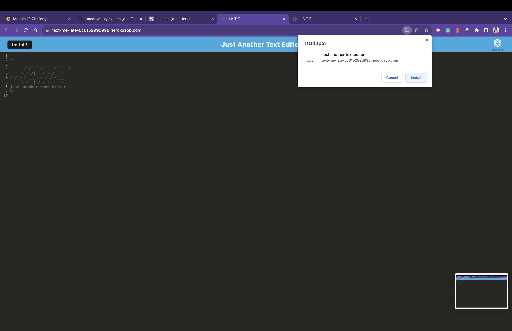

# link-minds

## Description

Deployed application link on GitHub
https://github.com/itcreativeusa/text-me

Deployed application link on Heroku

Text-me Progressive Web Application is a text editor that runs in the browser and creates notes or code snippets with or without an internet connection.

## Table of Contents

- [Installation](#installation)
- [Usage](#usage)
- [Screenshots](#screenshots)
- [Requirements](#requirements)
- [Credits](#credits)
- [License](#license)

## Installation

Use command-line to run the application.
Run `npm install` to install the required dependencies.
Run `npm run start` from the root directory to start the server.

## Requirements

N/A

## Usage

Run `npm run start` from the root directory to start the server.

## Screenshots

Screenshot located in `./img/` folder

## Credits

Some code for this project was taken from Mini-Project provided by Berkeley Bootcamp for studying purposes.

## License

Please refer to the LICENSE in the repo.
